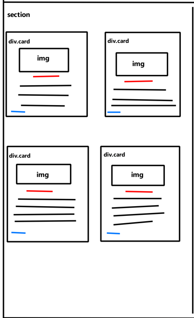
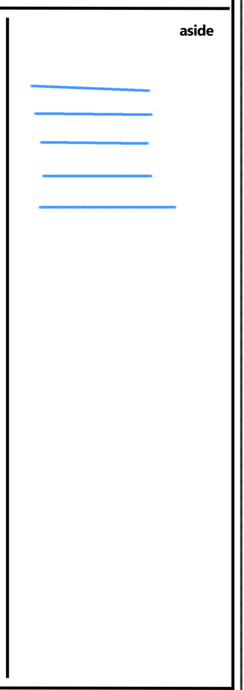
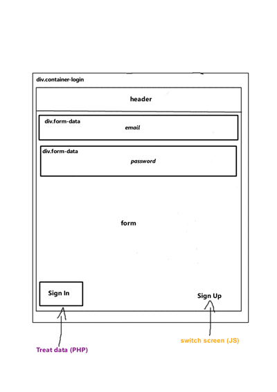
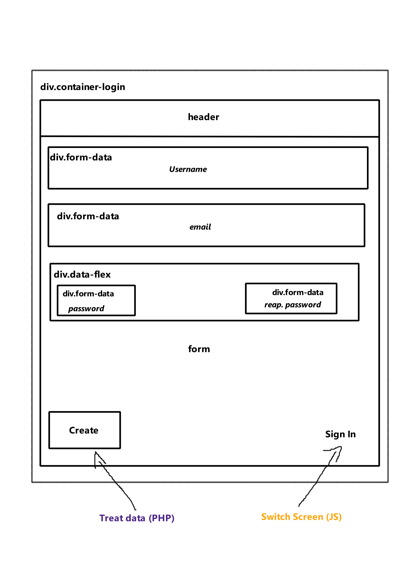

# Web Projects
I've been doing some projects for studies and practice my Web Development skills.

Here's a link list of some of them:

- [Web Project 1: News website](https://github.com/HarllonCS/news-website)
- [Web Project 2: Math Solver](https://github.com/HarllonCS/math-solver)

OBS.: As I save projects on GitHub, I also update the list.

# Web Project: News Website
The idea of this website is to report on some things that are happening or happened around the world. Highlighting the most urgent and interesting ones, leaving the user increasingly updated and attentive to the news.

## Page outline images

### Main Section
The main news will be displayed in the **Main Section**. With this, the user will not waste a lot of time looking for that information that is leaving the whole world awestruck.

### Side Section
The old news, which is related to the **Main Section** contents, is found in the **Side Section**.

### Login and Sign Up
Both the **Login screen** and the **Sign Up screen** are made entirely with *JavaScript*, so that the user can switch between them on the same page.
The website login can be done if the user wants to participate in the **Comments Section** (not done yet) and receive the news by e-mail.

Then he/she will be redirected to the Login Page.

By clicking on the *Sign Up* button, instead of loading an HTML file, the screen will be switched to the **Sign Up screen**.

